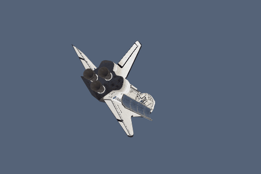

# OBJ-Model-Renderer

A framework for rendering Obj 3D models with textures for understanding the Vulkan API.

## Screenshots


## Build

### Windows
```
git clone --recursive https://github.com/lanwenzhang/OBJ-Model-Renderer.git
cd OBJ-Model-Renderer
mkdir build
cd build
cmake -G "Visual Studio 17 2022" -A x64 ..
```

## Dependencies
* [stb](https://github.com/nothings/stb)
* [tinyobjloader](https://github.com/tinyobjloader/tinyobjloader)

## Reference
* [Vulkan Tutorial](https://vulkan-tutorial.com/)
* [Vulkan C++ examples Sascha Willems](https://github.com/SaschaWillems/Vulkan)

