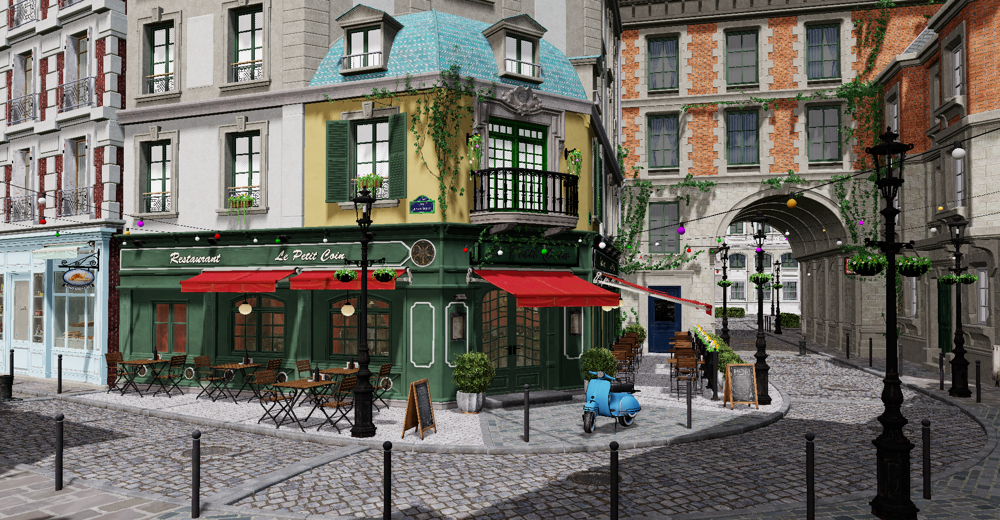

# LZ-Scene-Renderer

A real-time Vulkan renderer supporting large-scale 3D scenes, with scene graph management, indirect rendering, and multi-texture mapping

## Screenshots


## Features
- Scene graph
- Batch rendering
- Indirect rendering
- SSAO

## Build

### Windows
```
git clone --recursive https://github.com/lanwenzhang/LZ-Scene-Renderer.git
cd LZ-Scene-Renderer
mkdir build
cd build
cmake -G "Visual Studio 17 2022" -A x64 ..
```

## Dependencies
* [stb](https://github.com/nothings/stb)
* [assimp](https://github.com/assimp/assimp)
* [Vulkan SDK 1.4](https://vulkan.lunarg.com/)

## Reference
* [Vulkan Tutorial](https://vulkan-tutorial.com/)
* [3D Grphics Rendering Cookbook 2nd Edition](https://github.com/PacktPublishing/3D-Graphics-Rendering-Cookbook-Second-Edition/tree/main)
* [McGuire Computer Graphics Archive](https://casual-effects.com/data/)
